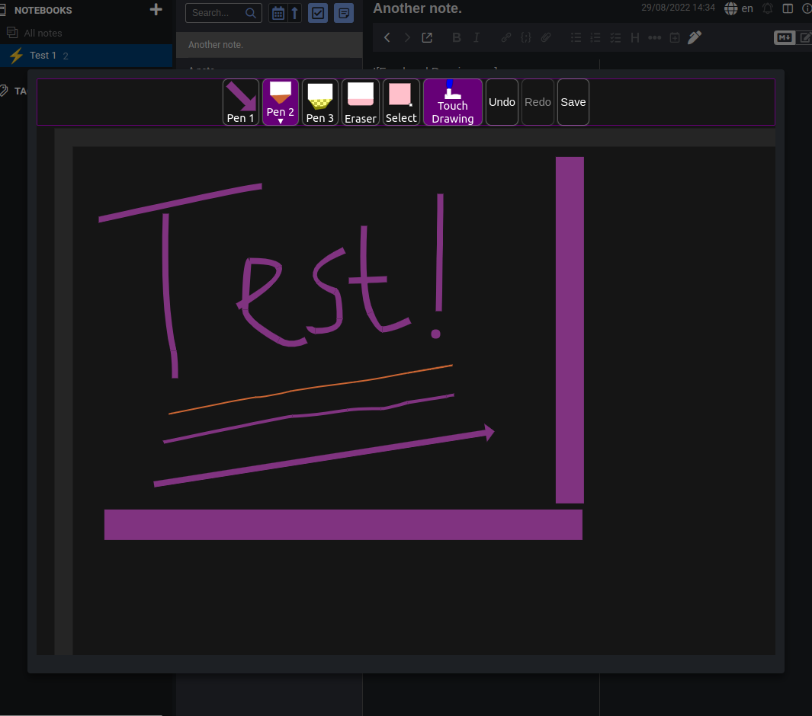

# `joplin-plugin-freehand-drawing`
[On GitHub](https://github.com/personalizedrefrigerator/joplin-plugin-freehand-drawing) | [On the Joplin Forum](https://discourse.joplinapp.org/t/plugin-js-draw-integration/27114)

A Joplin plugin for creating and editing freehand drawings.

## Installing
Search for "freehand drawing" under the plugins tab in Joplin's settings:

After installation, an "insert drawing" button should appear in the toolbar:

Existing drawings can be edited by hovering over the drawing in the markdown preview pane, then clicking "edit".

# Notes
 * This plugin uses [js-draw](https://github.com/personalizedrefrigerator/js-draw) to edit/create freehand drawings. Bugs related to `js-draw` can be reported using its [issue tracker](https://github.com/personalizedrefrigerator/js-draw/issues).

# Development
## Building the plugin

The plugin is built using Webpack, which creates the compiled code in `/dist`. A JPL archive will also be created at the root, which can use to distribute the plugin.

To build the plugin, simply run `yarn run dist`.

The project is setup to use TypeScript, although you can change the configuration to use plain JavaScript.

## Updating the plugin framework

To update the plugin framework, run `npm run update`.

In general this command tries to do the right thing - in particular it's going to merge the changes in package.json and .gitignore instead of overwriting. It will also leave "/src" as well as README.md untouched.

The file that may cause problem is "webpack.config.js" because it's going to be overwritten. For that reason, if you want to change it, consider creating a separate JavaScript file and include it in webpack.config.js. That way, when you update, you only have to restore the line that include your file.
