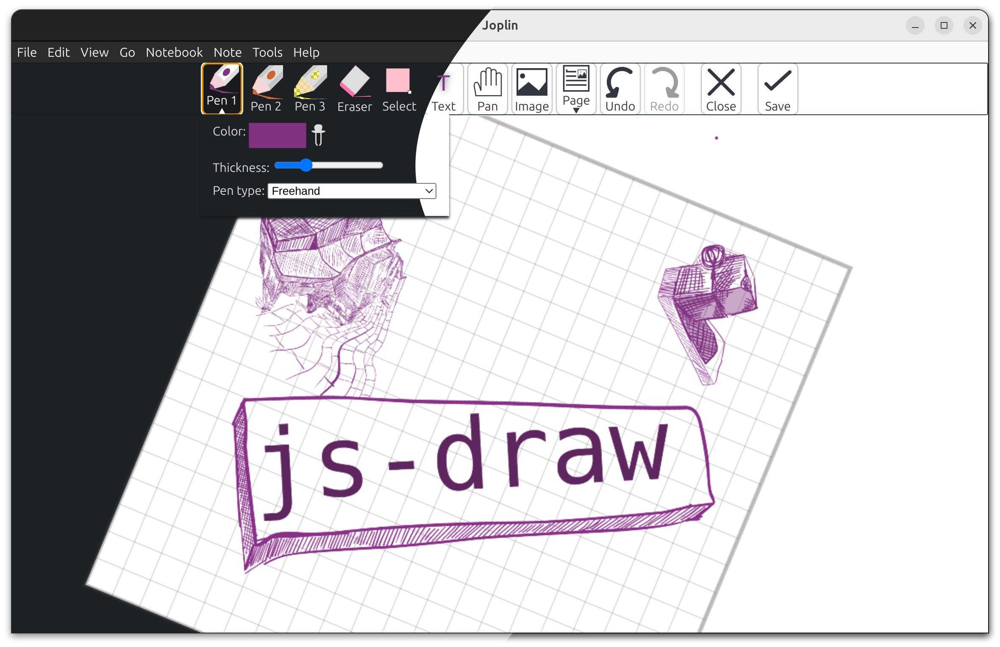

# `joplin-plugin-freehand-drawing`

[On GitHub](https://github.com/personalizedrefrigerator/joplin-plugin-freehand-drawing) | [On the Joplin Forum](https://discourse.joplinapp.org/t/plugin-js-draw-integration/27114) | [Online Demo](https://personalizedrefrigerator.github.io/js-draw/example/index.html) | [Installing](https://github.com/personalizedrefrigerator/joplin-plugin-freehand-drawing#installing)

A Joplin plugin for creating and editing freehand drawings using [js-draw](https://github.com/personalizedrefrigerator/js-draw).

## Installing

Search for "freehand drawing" under the plugins tab in Joplin's settings:

After installation, an "insert drawing" button should appear in the toolbar:

Existing drawings can be edited by hovering over the drawing in the markdown preview pane, then clicking "edit".

# FAQ

## How do I edit drawings from the rich text editor?

**Editing an existing drawing**: Double-click on the drawing.

**Adding a new drawing**: Click either the  toolbar button or "Insert Drawing" from the `Edit` menu.

> **Warning**
>
> To insert drawings in the rich text editor, this plugin works around [this Joplin bug](https://github.com/laurent22/joplin/issues/7547) by **briefly switching to the markdown editor** and back to the rich text editor. This clears the rich text editor's undo history. This should only **apply to new drawings.** 
> 

## I only use the markdown editor (no viewer). How do I edit drawings?

First, select the full resource URL for an image created with this plugin

Next, click the "Insert Image" button in the toolbar.

## How do I assign a keyboard shortcut to the "Insert Image" button?

1. Open Joplin's settings
2. Click on "Keyboard Shortcuts"
3. Search for "Insert Drawing"
4. Click "_Disabled_"
    
5. Entering a new key combination (e.g. <kbd>Ctrl</kbd>-<kbd>Shift</kbd>-<kbd>D</kbd>).

## How do I disable drawing with touch?

Pen/mouse-only drawing can be enabled under the "Pan" tool's menu by **enabling "Touchscreen panning"**:

## How do I report a bug related to the image editor?

This plugin uses [js-draw](https://github.com/personalizedrefrigerator/js-draw) to edit/create freehand drawings. Bugs related to `js-draw` can be reported using its [issue tracker](https://github.com/personalizedrefrigerator/js-draw/issues).

If you're unsure whether a bug is related to `js-draw` or this plugin, consider first [reporting the bug on this plugin's GitHub repository](https://github.com/personalizedrefrigerator/joplin-plugin-freehand-drawing/issues/new/choose). If it's more relevant to `js-draw` than this plugin, it will be moved by a maintainer.
